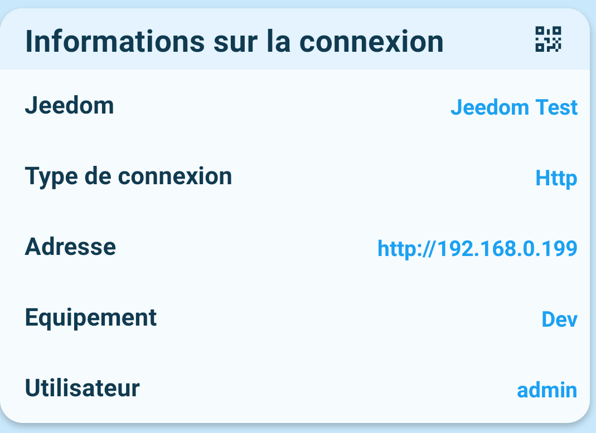
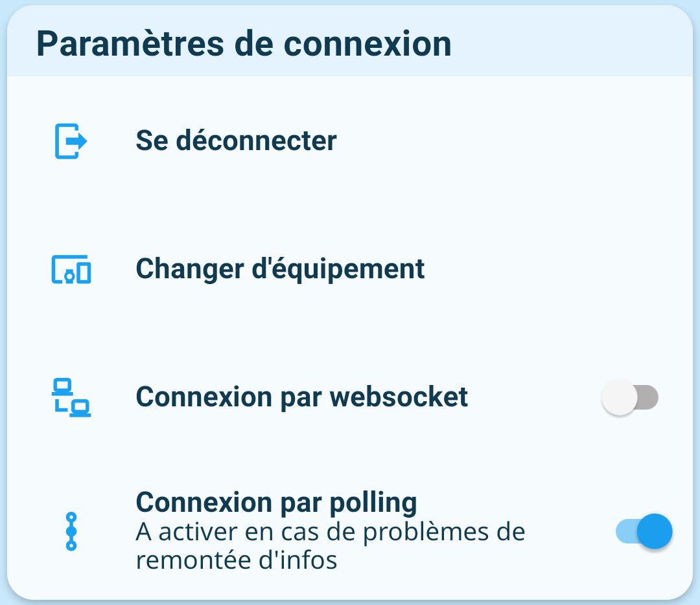

## Informations sur la connexion

### Bouton QR code
Le bouton  vous permet de télécharger sur votre appareil le QR Code de connexion à l'équipement en cours.

### Jeedom
Nom du serveur Jeedom auquel l'application est connecté (défini dans Jeedom dans `Configuration` / `Général` / `Nom de votre Jeedom`).

### Type de connexion
Indique le type de connexion en cours d'utilisation (`Http` ou `Websocket`).

### Adresse
Indique l'adresse de connexion actuellement utilisée pour la connexion à Jeedom.

### Equipement
Donne le nom de [l'équipement](../../../plugin/equipment/add-equipment) auquel l'application est connectée.

### Utilisateur
Nom de l'utilisateur Jeedom rattaché à l'équipement.

## Paramètres de connexion

### Se déconnecter
Déconnecte l'application de l'équipement.  
Pour se reconnecter sur une autre instance de Jeedom, il est fortement conseillé de supprimer les données.

### Changer d'équipement
Permet de se reconnecter sur un autre équipement du même Jeedom.  
L'application redémarre après changement.

### Connexion par websocket
Configure l'accès en websocket

### Connexion par polling
Configure l'accès en polling (le websocket doit être désactivé).