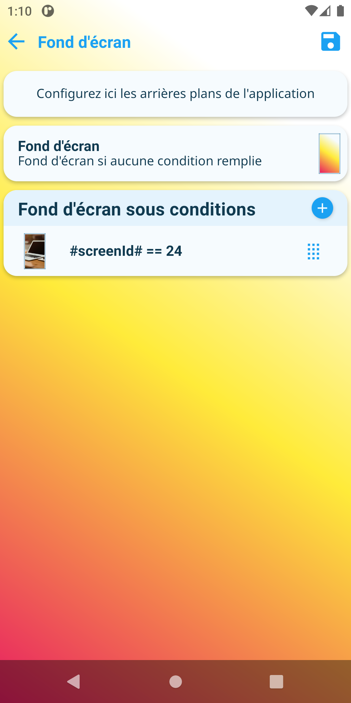

Les paramètres de cette page font parti de la [configuration de l'appareil](../../../plugin/equipment/deviceConfig).

## Fond d'écran
Choix de l'arrière-plan par défaut de l'application via un [sélecteur d'arrière-plan](../../interface/backgroundPicker).

## Fond d'écran sous conditions

Liste d'arrière-plans sous conditions. Ces paramètres prévalent sur l'arrière-plan par défaut.  
Les conditions sont vérifiées dans l'ordre définie dans cette liste, la première condition valide donnera alors le fond d'écran associé.  
Les conditions peuvent contenir :
- Des commandes infos Jeedom
- Des variables parmi lesquelles :
  - `#bottomTabId#` : id du menu bas en cours (visible en survolant la souris sur les menus bas)
  - `#topTabId#` : id du menu haut en cours (visible en survolant la souris sur les menus haut)
  - `#screenId#` : id de la page en cours. Valeurs possibles :  
    1 : Page principale  
    2 : Page Pièces  
    3 : Page Notifications  
    4 : Page scénarios  
    5 : Page Préférences  
    6 : Page Applications  
    7 : Page Batteries  
    8 : Page Santé  
    9 : Page MaJ Plugins  
    10 : Page détails  
  - `#roomId#` : id de la pièce en cours lorsqu'on est dans la page Pièces. Utilisez 0 pour le premier onglet Pièces

:::note

Ces paramètres peuvent être surpassés par les arrière-plans définis au niveau des menus bas/haut.

:::
