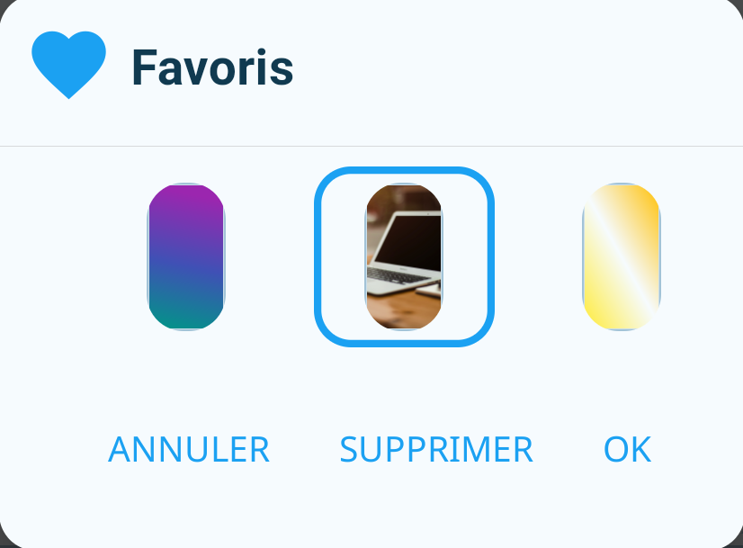
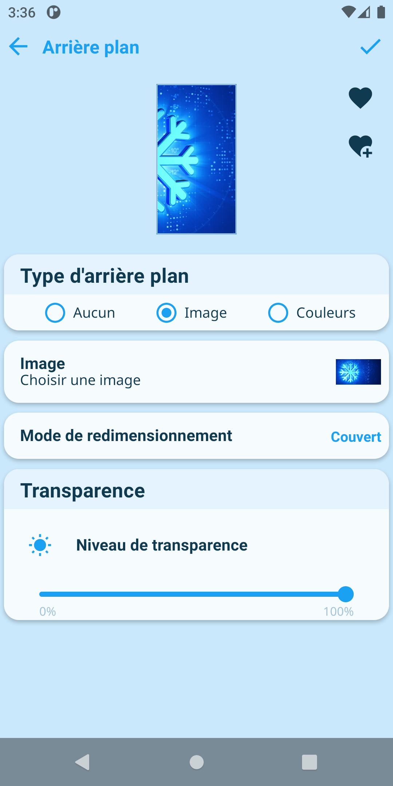
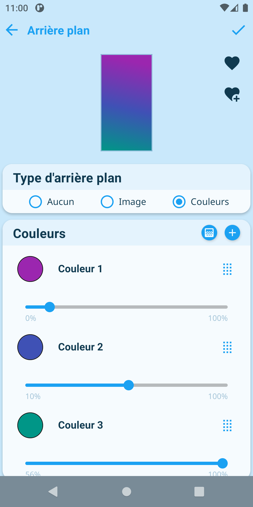
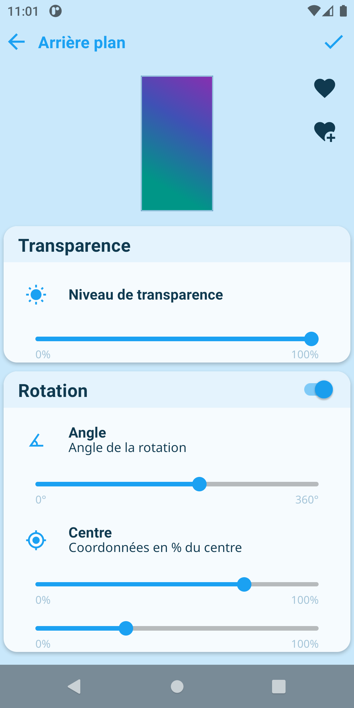
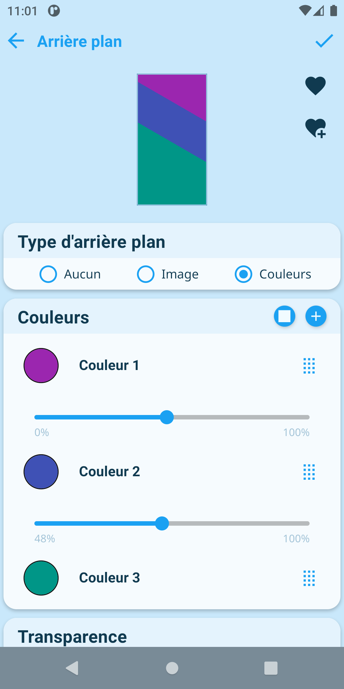

## Favoris

Afin de partager facilement des arrière-plans à travers différents éléments de l'application, Jeedom Connect dispose d'un système de gestion de favoris.  
Le bouton  permet d'accéder aux favoris alors que  ajoute l'arrière-plan actuel à la liste.

## Aucune

L'arrière-plan sera calculé automatiquement en fonction du contexte.

## Image

### Image

Sélection de l'image à afficher.

### Mode de Redimensionnement

Méthode de redimensionnement de l'image dans sa vue parent.

- Contenu : Mise à l'échelle uniforme (respecte le ratio) de sorte que les dimensions (hauteur et largeur) sont inférieures ou égales à la dimension correspondante de la vue parent.
- Couvert : Mise à l'échelle uniforme (respecte le ratio) de sorte que les dimensions (hauteur et largeur) sont supérieures ou égales à la dimension correspondante de la vue parent.
- Etire : Mise à l'échelle de la hauteur et largeur indépendemment de sorte que les dimensions (hauteur et largeur) sont égales à la dimension correspondante de la vue parent. Ce mode peut modifier le ratio de l'image.
- Centre : N'applique pas de mise à l'échelle de l'image et la garde centrée dans la vue parent.

### Transparence

Détermine la transparence de l'arrière-plan.

## Couleurs

## Gradient

Le bouton  permet de choisir si on veut un dégradé entre les différentes couleurs.

### Couleurs

Liste des couleurs qui constituent l'arrière plan.

### Transparence

Détermine la transparence de l'arrière-plan.

### Rotation

Applique une rotation à l'arrière-plan.  
L'angle est exprimé en degrés et les coordonnées du centre en pourcentatge de la vue parent.
