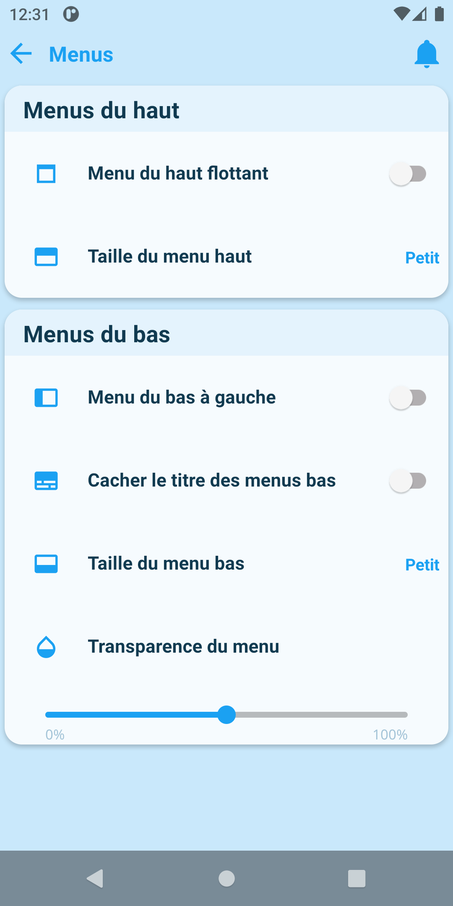

Ces paramètres concernent les menus bas / haut définis dans la [configuration de l'appareil](/docs/documentation/plugin/equipment/deviceConfig).

## Menus du haut

### Menu du haut flottant

Si coché, les éléments du menu haut seront centrés à l'écran et dans des bulles.

### Taille du menu haut

Configure la taille de la police des titres du menu haut.

## Menus du bas

### Menu du bas à gauche

Permet de déplacer le menu bas à gauche de l'écran (utile en mode paysage).

### Taille du menu bas

Configure la hauteur du menu bas.

### Transparence du menu

Configure la transparence du menu bas.
