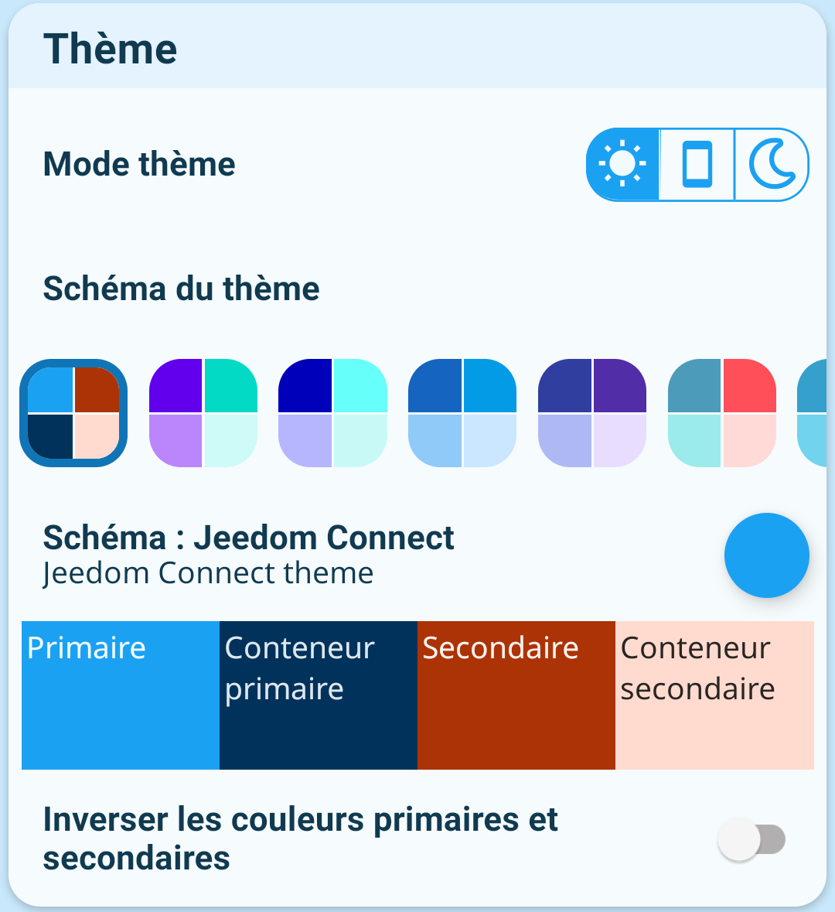
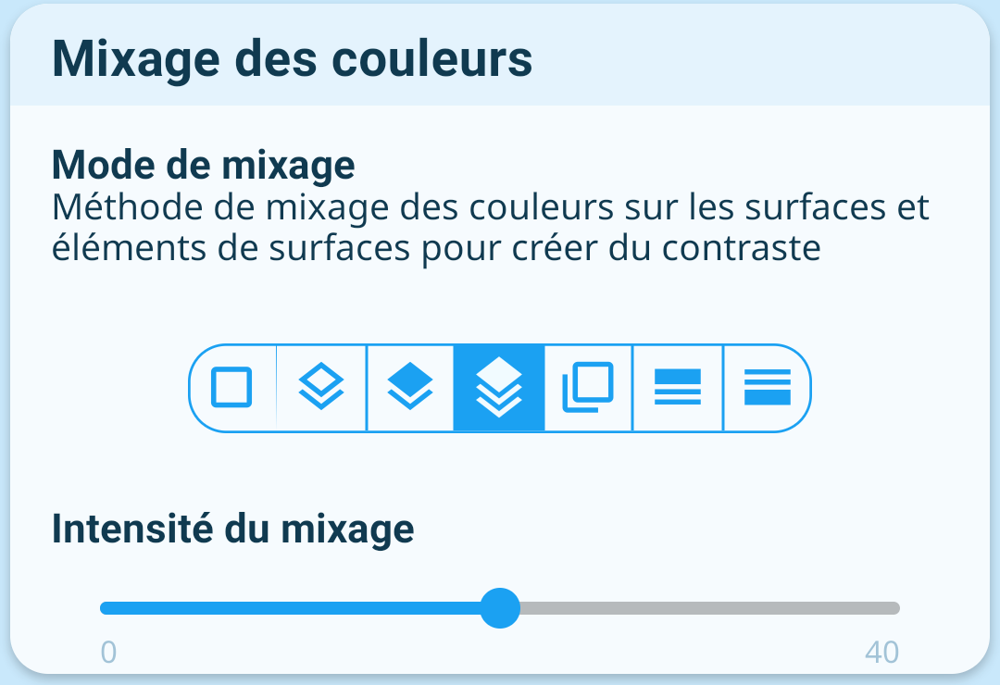
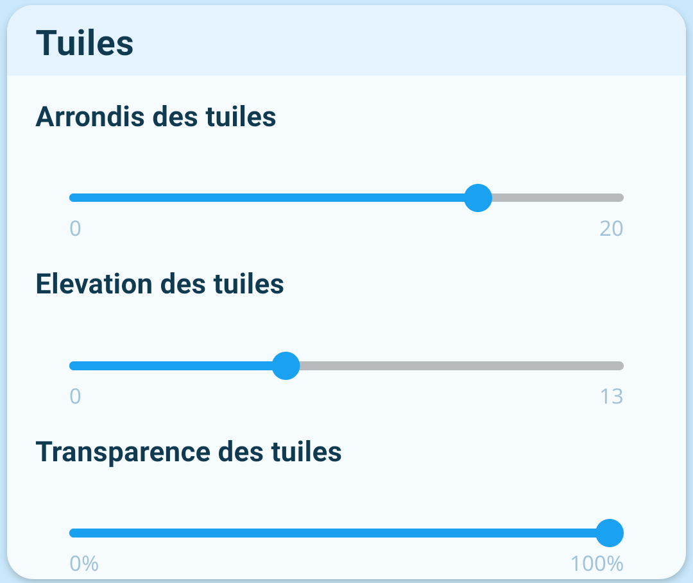

## Thème

### Mode du thème

Permet de sélectionner le thème clair sombre ou automatique (s'ajuste en fonction du mode défini par le système).

### Schéma du thème

Jeedom Connect dispose d'une large gamme de palette de couleurs (appelés schémas) qui s'appliquent automatiquement à certains composants de l'application.  
Chaque schéma dispose de deux couleurs primaire et secondaire, et de couleurs de conteneurs qui en sont dérivées.  
Les couleurs primaires et secondaires peuvent être inversée via le bouton associé.  

:::tip
Le schéma `Custom` (dernier dans la liste) permet de personnaliser les couleurs primaires et secondaires.
:::

## Mixage des couleurs

### Mode de mixage

Les couleurs des différents éléments de surface de l'application (arrière-pla, cartes, bordures...) et de texte sont calculées automatiquement en fonction du schéma de couleur défini, afin de créer une cohérence et du contraste qui facilite la vision. Vous pouvez sélectionner ici différentes méthodes de calculs.

### Intensité du mixage

Ceci est un paramètre supplémentaire qui entre en jeu dans le rendu du mixage de couleurs.  
Plus l'intensité est élevée, plus le contraste entre les différents éléments sera important.

## Tuiles

Les tuiles sont les cartes qui apparaissent un peu partout dans l'interface.

:::warning Attention
Les paramètres de cette section ne s'appliquent pas aux widgets.
:::

### Arrondis des tuiles

Gère l'arrondi des coins de la tuile (rond ou carré).

### Elévation des tuiles

Gère l'élévation des tyuiles, qui permet de donner un effet de relief.

### Transparence des tuiles

Gère la transparence de l'arrière-plan des tuiles.
