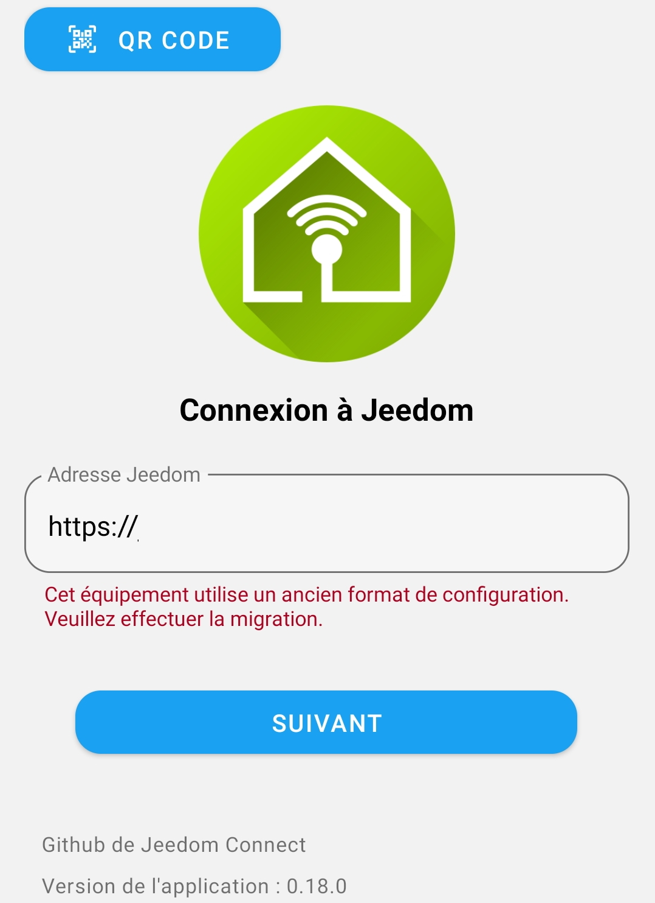
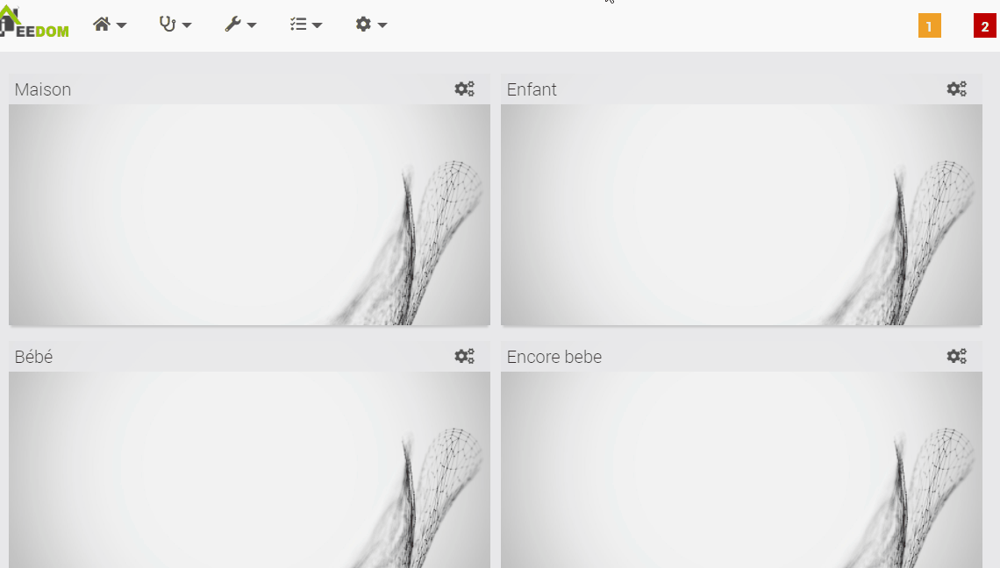
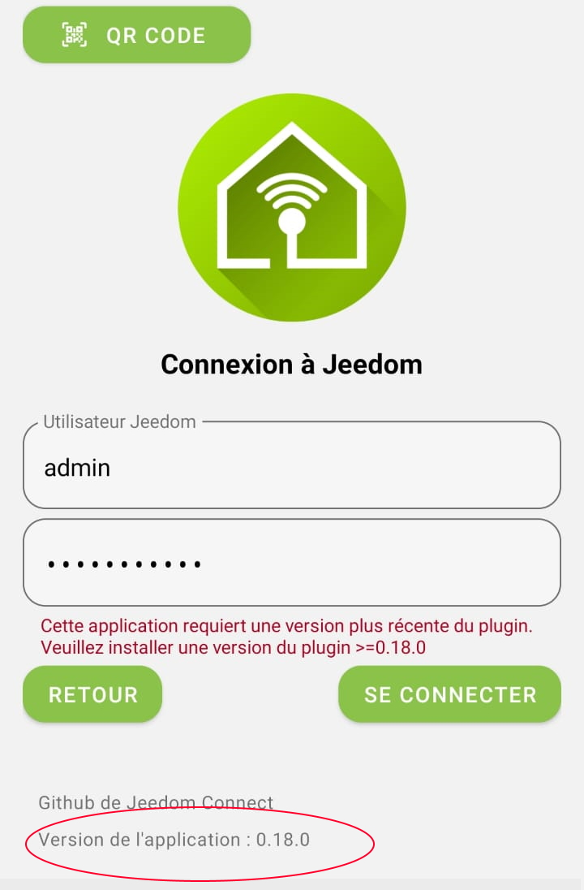
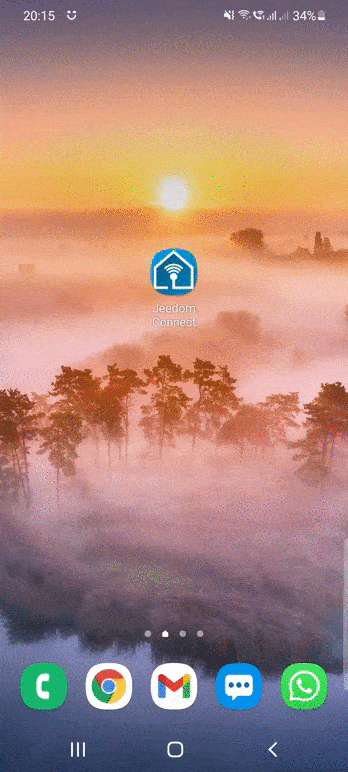
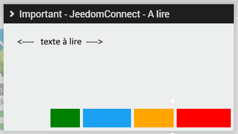
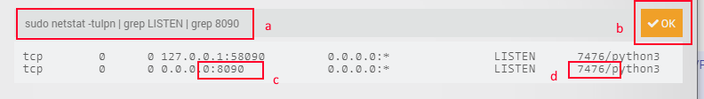

# FAQ

## Comment télécharger l'application ? {#qOU}

L'application est disponible sur vos Store :
  
  

 

## Quelle est la différence entre connexion HTTP, Websocket et Polling ? {#qConnexion}  

Avec Jeedom Connect, il est possible d'établir la connexion entre votre appareil et le plugin de deux façons différentes :

- **Http** : Au lancement de l'application, une connexion Http de type Source Event Server est établie avec le plugin. Cette connexion est persistente mais uni-directionnelle : de Jeedom **vers** votre appareil. Les actions de votre appareil vers Jeedom sont des requêtes Http uniques utilisant le protocole JSON RPC.
Ce mode de connexion ne necéssite aucune configuration particulière.
- **Polling** : Lorsque les états ont du mal à être rafraichi, vous pouvez utiliser cette option. Ici c'est l'application qui lance une connexion vers le plugin pour forcer la récupération des informations de façon régulière. Cette option est plus que conseillée lorsque vous utilisez les DNS Jeedom (incompatible avec `websocket`).
- **Websocket** : La connexion websocket est quant à elle bi-directionnelle. Elle nécessite néanmoins une configuration de votre réseau pour être utilisée en dehors de votre réseau local. Il est possible de faire une redirection de port sur votre routeur (méthode simple) ou bien de configurer votre serveur proxy ou le serveur Apache de votre Jeedom (utilisateurs avancés, incompatible avec `polling`).

Le Websocket offre une connexion **plus stable et plus performante** que la connexion Http.

 

## L'application m'indique "Cet équipement utilise un ancien format de configuration. Veuillez effectuer la migration" {#qMigration}  

La migration était une étape nécessaire lors de l'utilisation de la version 0.18.0, elle n'est donc plus à utiliser.  
Si vous voyez cette erreur, c'est que le fichier de configuration de votre équipement est corrompu (mauvaise manip, mauvais import, .. ). Récupérez une ancienne sauvegarde de Jeedom et dézipper-là pour restaurer le fichier de configuration en question (disponible dans `plugins/JeedomConnect/data/configs/<apiKey de l'équipement>.json` )

Ancienne méthode

  

La mise à jour que vous venez de réaliser nécessite une mise à jour au niveau du fichier de configuration utilisé pour définir vos widgets.  
Que va faire cette opération ? Elle va lire votre(vos) fichier(s) de configuration et créér automatiquement tous les widgets correspondant.  
:warning: si vous avez plusieurs équipements (téléphone/tablette/...) de configurés, il y a de forte chance que l'opération créé des widgets en doublon (ou plus).  
Deux choix s'offrent à vous :  

  1. migrer UN seul de vos équipements (appareils), exporter sa configuration puis l'importer sur tous vos autres équipements :  
      - le + : pas de widgets créés en doublon, pas de longue suppression manuelle à réaliser
      - le - : si certains de vos appareils ont des widgets bien à eux, il faudra alors les recréer manuellement  
  2. migrer l'ensemble de vos équipements :  
      - le + : tous les widgets seront créés automatiquement
      - le - : chaque équipement étant migré comme s'il était seul, certains widgets seront créés en doublon. Vous aurez donc besoin de faire un peu de ménage en modifiant les configurations de certains équipements puis en supprimant les widgets inutiles en doublon.

Nous préconisons la solution #1 ! Voici comment nous vous proposons de faire :

- commencer par mettre le niveau de log en `DEBUG` sur l'application (page `configuration` du plugin, pensez à sauvegarder !)
- désactiver l'ensemble de vos équipements sous le plugin JeedomConnect, et n'en laisser qu'<b>UN SEUL actif</b> (le plus utilisé, ou celui qui contient le plus de widgets)
  

- rendez-vous sur la page `configuration` de votre plugin (Menu `Plugins/Gestion des plugins/Jeedom Connect`)  
  

L'option `Migration des configurations` va vous aider à réaliser cette mise à jour.  

- sélectionnez le choix `uniquement les équipements actifs`  
- cliquez sur le bouton `Migrer`  
Un message de confirmation vous indique que tout s'est bien passé !  
Vous pouvez retourner sur votre page principale du plugin JeedomConnect et vous devriez voir quelques changements : l'ensemble de vos widgets sont maintenant disponibles directement sur cette page.  
- vous pouvez maintenant ouvrir la configuration de votre appareil, faire un `export` de la configuration, puis sur chacun de vos autres équipements `importer` cette configuration, puis réactiver vos équipements.

 

## J'ai l'erreur suivante "Cette application requiert une version plus récente du plugin" {#qVersion}

Pour fonctionner, il faut que le plugin installé sur Jeedom et l'application (APK) que vous avez téléchargés et utilisés soient alignés.  

| Version Plugin | Version Application | Fonctionnement |
|----------------|----------------|----------------|
| Stable         | Stable         |                    |
| Stable         | Beta           |                |
| Beta           | Beta           |                |
| Beta           | Stable         |                |

La version du plugin est disponible sur la page de `configuration` du plugin :  
  
 
La version de l'application est disponible sur la page de connexion :  
  
ainsi qu'en bas de la page `Préférences` (dans la menu de l'application) :  
  

 

## Je suis bêta-testeur, que dois-je faire ?{#qBeta}
  
Comme son nom l'indique, la version bêta n'est pas une version stable. En l'utilisant, vous savez et acceptez que celle-ci puisse comporter des anomalies, remonter des états incohérents, réaliser (ou pas) des actions, etc ...
  
Afin d'utiliser le plugin en version bêta, il est nécessaire d'avoir l'application correspondante. Celle-ci est également disponible sur le Store, mais pour y accéder vous devez au préalable être enregistré en tant que bêta-testeur auprès du Store.  
Cette inscription est à <a href="https://play.google.com/apps/testing/com.jeedomconnect.app" target="_blank">faire ici pour Android</a> et <a href="https://testflight.apple.com/join/luZsKILI" target="_blank">ici pour Apple</a> (besoin d'avoir l'application <a href='https://apps.apple.com/fr/app/testflight/id899247664'>TestFlight</a> pour ce dernier!)

 

## Je ne vois pas la batterie d'un de mes équipements sur JC, pourquoi ? {#qBattery}  

Seules les batteries disponibles sur la page `index.php?v=d&p=eqAnalyse` de votre jeedom sont remontées dans JeedomConnect.  
Si votre batterie n'apparait pas sur cette page, alors elle n'apparaitra pas sur JeedomConnect !  

Comment l'ajouter ? Rapprochez-vous du développeur du plugin utilisé par votre équipement afin qu'il fasse en sorte que la batterie soit visible sur la page indiquée plus haut ;)

 

## Comment « vider le cache » ou « supprimer les données » ? {#qVideCache}  

  

1. Appui long sur l’icone 'JeedomConnect' (sur votre bureau ou dans la liste de toutes vos applications disponibles)
2. Clic sur le petit `i`
3. Sélection 'Stockage'
4. Au choix (en fonction de ce que vous avez à faire!) : 'Vider le cache' et/ou 'Supprimer les données'

 

## Quelles différences entre l'édition et la personnalisation d'un widget ? {#qEditCustom}  

- Editer un widget :
  - permet de modifier la configuration d’un widget.
  - ces modifications impactent l’ENSEMBLE des équipements.
  - ces modifications sont directement visibles depuis la page principale côté plugin

>
> exemple : je modifie la commande « ON » de ma lumière, tous mes équipements (mes téléphones) sont mis à jour avec cette nouvelle commande  
>

- Personnaliser un widget :
  - permet de personnaliser la configuration d’un widget sur UN équipement
  - ces changements ne sont pas visibles côté plugin
  - ces changements n’impactent pas tous les équipements, mais seulement celui sur lequel on fait le changement
  - ces changements surchargent et sont prioritaires par rapport à la définition standard du widget

>
> exemple : par défaut mon widget fenetre est configuré pour avoir une fenêtre fermée bleu. ma femme prefère le jaune (ca lui rappelle le soleil des vacances), sur son équipement je vais donc personnaliser le widget fenêtre pour modifier l’icone de fenetre fermée avec la couleur jaune. Cette fenêtre jaune sera uniquement appliquée sur son équipement à elle.  
>

 

## Lors de ma première utilisation une pop-up me demande de "Sélectionner une application de l'écran d'accueil", que dois-je faire ? {#qSetLauncher}  

Cette option est principalement utilisée pour les appareils qui ne serviront qu'à faire de la domotique (par exemple une tablette murale pour gérer votre domotique). Le launcher ou 'application de l'écran d'accueil' permet de définir JeedomConnect comme votre nouveau bureau.  
Vous n'aurez donc plus accès à la page d'accueil de votre terminal tel que vous la connaissez avec toutes vos applications, mais votre page principale sera dorénavant JeedomConnect

  

 

## Mon téléphone reste "bloqué" sur JeedomConnect. Comment retirer le mode launcher ? {#qLauncher}  

Si vous souhaitez retirer le mode launcher de votre téléphone, il vous suffit d'aller dans le menu "Application d'accueil"  (le chemin peut différer selon votre modèle du téléphone)  
`Paramètres du téléphone (par la barre du haut/roue crantée) / Applications / Applications par défaut / Application d’accueil`

  

 

## Comment configurer le widget Caméra ? {#qCamera}  

  

en jaune :  
ce sont des données qui sont utilisées pour remplacer des informations saisies sur les champs `url de flux` et `url de snapshot` (champs 1 et/ou champs 2)  

en rouge : les informations pour récupérer un flux vidéo.  
il faut uniquement remplir l’un des deux champs :  
soit indiquer directement l’url à utiliser pour avoir la vidéo  
OU  
soit indiquer la commande qui renverra l’url à utiliser pour voir la vidéo  
*Si vous souhaitez accèder au flux vidéo depuis l'extérieur, une possibilité est de faire des redirections de port pour rendre le flux rtsp accessible depuis l'extérieur (à vos risques et périls donc :) [un exemple ici](https://community.jeedom.com/t/camera-ezviz-c6n-url-snapshot/63957/2) )*

en vert :  
si la configuration mise pour la vidéo (en rouge!) est accessible depuis l’extérieur : à décocher  
si la configuration n’est accessible que sur le réseau local : à cocher  

en bleu : les informations pour prendre une photo.  
il faut uniquement remplir l’un des deux champs :  
soit indiquer directement l’url à utiliser pour prendre une photo  
OU  
soit indiquer la commande qui renverra l’url à utiliser pour prendre la photo  

en rose :  
permet de réduire le nombre de photos reçues ainsi que la qualité  

  
un exemple
  

  
   
url de flux : j’ai indiqué une IP locale => la caméra n’est pas visible depuis l’extérieur de mon domicile  
DONC je coche la case LAN    

l’utilisateur et le mot de passe seront automatiquement remplacés dans les url de flux et de snapshot    

quand je suis en wifi => je vois la vidéo en direct   
quand je suis en 4G => je reçois une photo toutes les 5 sec, avec une qualité de 70% 

 

## J'ai un message "A lire" qui n'arrête pas de s'afficher. Comment le masquer définitivement ? {#qWarning}  

 
  

rassurez-vous, il n’y a AUCUN bug sur cette fenêtre, si elle réapparait systématiquement c'est que vous faites mal quelque chose :)  

Devant le nombre de fois où nous sommes obligés de (re)demander d’avoir les infos sur votre installation, j’ai mis en place une petite fenêtre d’information « A lire » qui s’affichera lorsque vous irez sur la page principale du plugin :  

Pour infos :  

- les 4 boutons sur le bas ne sont initialement pas présents, et s’afficheront 10 sec après que la fenêtre ait été affichée (pile poil le temps de vous laisser lire !)
- si vous cliquez en dehors de la fenêtre pour la fermer ou cliquez sur un « mauvais » bouton => le message se réaffichera dans la journée, à l’infini...  
- si vous lisez correctement & entièrement l’info et que vous appuyez sur le bon bouton, la fenêtre n’apparaitra plus dans la journée. Par contre ... 2 nouveaux « rappels » suivront sur les 2 jours suivants, juste pour être sûr que c’était pas un coup de chance et que vous avez bien lu :) :)

--> du coup le 1er qui me dit qu’il n’avait pas vu l’info, devra ma payer un cocktail ! :D

le process peut-être un peu chiant, j’en suis désolé, mais pas plus enquiquinant que moi qui suit sans cesse obligé de demander les infos 1 sujet sur 2 !
après tout… il n’y a pas de raison qu’il n’y ait que moi qui ait la partie chiante :D :D :D  

bonne lecture, et attention à vos clics !  

 

## Les cartes de geofence et de localisation sont centrées sur Paris par défaut, comment changer ? {#qCarteParis}  

Les différentes cartes se centrent sur la position définie sur la page configuration du plugin JC.  
Si ces informations ne sont pas renseignées, nous prenons alors les coordonnées de votre Jeedom (`Réglages / Systèmes / Configuration / Coordonnées`). Dans le cas où ces dernières ne sont pas indiquées, alors par défaut nous centrons sur Paris.

 

## Comment formater une date/heure dans les widgets ? {#qDatetime}  

Direction quelques exemples donnés [ici](#momentjs)

 

## J'ai un message "Address already in use" au démarrage du démon, comment faire ? {#qAddressUsed}  

Il y a deux options :

1. La plus simple : redémarrez votre Jeedom
2. La plus risquée : killez le processus qui utilise déjà ce port (il y a de forte chance que ce soit la précédent démon de JC qui ait mal été stoppé, mais il se peut que ce soit autre chose ... )  
Allez dans `Réglages > Système > Configuration > OS/DB > Administration Système`  
sur la nouvelle page qui s'affiche :
  a. tapez la commande suivante `sudo netstat -tulpn | grep LISTEN | grep 8090` (si vous avez gardé le port `8090` par défaut, sinon changez le)  
  b. validez avec `OK`  
  c. trouvez la ligne qui correspond au port que vous recherchez  
  d. notez le numéro de processus qui tourne --> ici le `7476`  
Ensuite dans la barre (a) changer la commande et tappez `sudo kill -9 7476` (évidemment remplacez `7476` par le nombre que vous avez trouvé en (d))  
Vous pouvez retourner sur la page configuration de JC pour redémarrer le démon

  

 

## Je trouve l'application géniale ! Comment vous aider ? {#qDon}  

En partageant vos idées d'améliorations, vos suggestions et vos retours sur des bugs !
Puisque ça a été demandé plusieurs fois, si vous souhaitez soutenir "financièrement" parlant, nous vous proposons de payer un café (ou deux, ou mille ! :) ) :  

Ou bien

 

## Je ne trouve pas de réponse à mon probleme dans la doc. Que faire ? {#qForum}  

Suivez les indications postées dans [ce message](https://community.jeedom.com/t/plugin-jeedomconnect-actualites/71794/2) afin de créer un nouveau sujet sur le forum.
