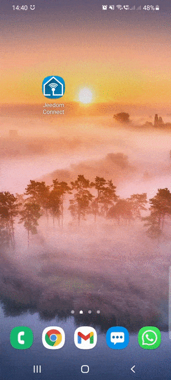
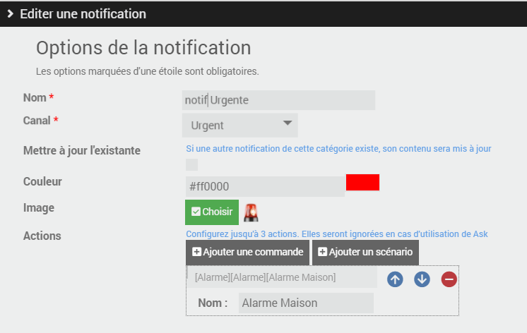
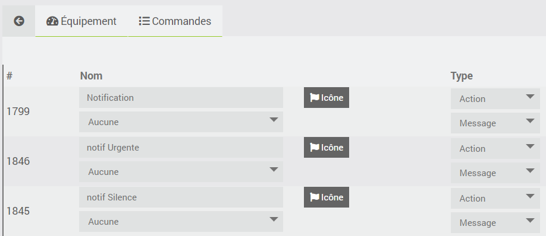
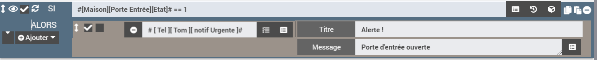
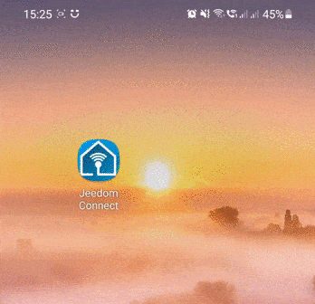
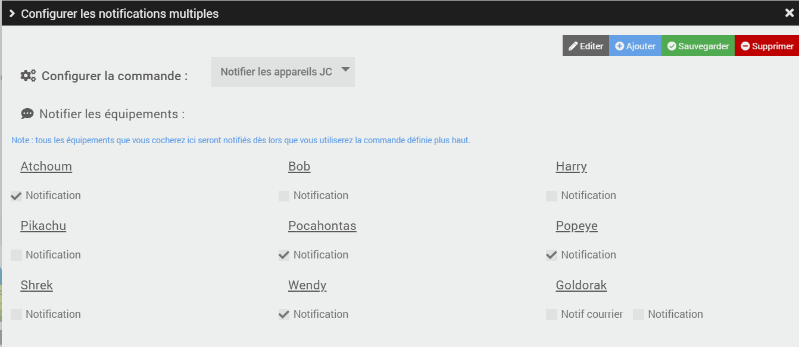

# Notifications

Vous avez la possibilité de gérer différents types de notifications sur l'application Jeedom Connect. Ces notifications peuvent être utilisées comme vous le feriez déjà avec l'envoi par Jeedom d'un SMS, Telegram, et autres sortes de messagerie.  
Vous pouvez donc vous envoyer des notifications (via des scénarios par exemple) : lorsque votre porte d'entrée s'ouvre alors que vous êtes absent, pour vous prévenir de sortir la poubelle, indiquer que le facteur est passé, ... vers votre application JeedomConnect.

## Les Canaux  

Dans le paramétrage des notifications, vous avez la possibilité de créer plusieurs canaux.  
Ces canaux permettent de définir différentes façon de réagir qu'aura votre smartphone à la réception d'une notification JeedomConnect.  

Par exemple depuis le plugin, vous pourriez créer un canal `Défaut`, un `Silence` et enfin un `Urgent` (propre à chaque équipement).
Ces canaux sont ensuite disponibles sur votre application mobile JeedomConnect. Faites un clic long sur l'icone JeedomConnect, puis 'informations', ensuite allez dans le menu 'notification' : vous devez alors voir les 3 canaux précédemment créés `Défaut`, `Silence` et `Urgent`.  

Vous pouvez alors les personnaliser : (toujours <u>en exemple</u>)

- le canal `Silence` recevra toutes les notifications pour lesquels je ne souhaite pas être dérangé : donc je choisis de ne pas avoir de son
- la canal `Urgent` par contre il faut absolument que je lise les notifications au plus vite, du coup je choisis une sonnerie bien particulière (je peux augmenter également le son), et je choisis l'option 'Ignorer ne pas déranger'

  

## Les notifications

Il faut ensuite créer les commandes notifications qui auront un lien avec nos canaux.
Dans l'onglet `notification`, (toujours en partant de <u>l'exemple</u> donnée au dessus), je crée donc 3 notifications : `notification` (créé automatiquement) en lien avec le canal `Défaut`, `notif silencieuse` que je lie au canal `Silence`, et `notif urgente` que je rattache au canal `Urgent`.  
Vous pouvez également :  

- mettre à jour l'existante : si cochée, alors vous ne verrez qu'une seule notification du même type dans votre barre de notification sur votre smartphone. (si décochée, chaque notification sera affichée)
- couleur : définit la couleur du titre de la notification sur votre smarphone, ainsi que celle de la notification
- image : permet d'ajouter une image sur le coin en haut à droite de la notification
- actions : permet de réaliser commandes et/ou scénario à chaque fois qu'une notification est envoyée. (<u>par exemple</u> : si envoi d'une notification urgente, je veux avoir la possibilité d'exécuter le scénario qui permet de déclencher l'alarme de la maison)

  

### Comment envoyer une notification ?

Une fois que vous avez paramétré vos différentes notifications, les commandes associées sont automatiquement créées sur votre équipement (après `sauvegarde`), dans l'onglet dédié comme sur tout équipement Jeedom :  
  

vous pouvez donc vous en servir dans un scénario ou n'importe quel autre type (interraction, bloc code, ...) :
  

Voici par exemple la réception d'une notification : (avec les configurations présentées précédemment, ça reste donc toujours qu'un exemple possible ! )

  

C'est une `notif Urgente` qui a été envoyée, donc puisque la notification est paramétrée sur le canal `Urgent`, mon téléphone sonne donc avec un fort volume même si je suis en mode 'ne pas déranger'.  
La notification est affichée en rouge dans la barre de notification Android, ainsi que lorsque je la visualise en entière dans l'application JeedomConnect, et on voit la présence d'un icône 'sirène rouge' dans le coin supérieur droit.
Et j'ai également la possibilité de cliquer sur le bouton `Alarme maison` pour exécuter le scénario que j'ai paramétré et qui déclenchera l'alarme de ma maison.

### Comment envoyer une notification à tous les appareils ?

Par défaut le fait d'envoyer à "tous" les appareils JC n'existe pas.  
En effet, il est possible de configurer plusieurs types de notifications par appareil, il nous est donc impossible de deviner lesquelles sont à utiliser.  
Vous pouvez créer plusieurs notification de type `Notifier tous`, il faut :

- aller sur la page principale du plugin et sélectionner sur `Notification multiples`
- cliquer sur `ajouter` pour créer un nouveau type de notification (on peut par exemple imaginer avoir un `Notifier les parents`, `Notifier les enfants`, `Notifier toute la famille`)
- selectionner l'ensemble des notifications qui devront être utilisées lorsque l'action sera réalisée
- sauvegarder les modifications pour ne pas les perdre
- Lors de la sauvegarde, une nouvelle commande est automatiquement créée sur chaque équipement qui ont été coché

  

## Options d'envoi

Une commande de notification a deux champs : `Titre` et `Message`. Le `Message` est le texte de la notification. Le `Titre` sert soit de titre simple, soit à passer des **options** (titre, page à ouvrir, images...).

### Les options disponibles

| Option | Valeur attendue | Effet | Android | iOS |
|---|---|---|---|---|
| `title` | texte | Titre de la notification. | ✅ | ✅ |
| `gotoPageIdOnTap` | `id` d'une page | Un **appui sur la notification** ouvre l'application directement sur cette page (ou y navigue si l'application est déjà ouverte). Sans cette option, l'appui ouvre la page *Notifications* de l'application. Accepte aussi les pages spéciales `notifications`, `scenarios`, `rooms`, `timeline`, `messages`, `webview`. | ✅ | ✅ |
| `gotoPageId` | `id` d'une page | Ajoute un **bouton** « Page *nom de la page* » sous la notification ; un appui sur ce bouton ouvre la page. | ✅ | ✅ |
| `gotoWidgetId` | `widgetId` d'un widget | Ajoute un **bouton** « Widget *nom du widget* » sous la notification ; un appui sur ce bouton ouvre le détail du widget. | ✅ | ✅ |
| `files` | chemin(s) de fichier(s) sur Jeedom | Joint des images ou des fichiers à la notification. Voir [Envoyer des images](#envoyer-des-images). | ✅ | ✅ |
| `launchActivity` | nom du *package* d'une application (ex. `com.android.chrome`) | Lance cette application lors d'un appui sur la notification ou sur l'un de ses boutons. Mêmes prérequis que la commande `Lancer App`. | ✅ | ❌ |
| `message` | texte | Remplace le contenu du champ `Message`. Utilisable uniquement dans le champ `Titre` (syntaxe 1 ci-dessous). | ✅ | ✅ |

:::info[Où trouver les identifiants ?]

- l'`id` d'une page (menu du bas, menu du haut ou pièce) s'affiche en survolant les menus avec la souris dans l'assistant de configuration de l'équipement ;
- le `widgetId` d'un widget est visible dans la configuration du widget sur l'équipement.

La page ou le widget doit faire partie de la configuration de l'équipement qui reçoit la notification. Sinon, aucun bouton n'est ajouté (`gotoPageId`, `gotoWidgetId`) et l'appui sur la notification ne change pas de page (`gotoPageIdOnTap`).
:::

### Syntaxe 1 : dans le champ `Titre`

Cette syntaxe fonctionne partout : bloc action d'un scénario, interaction, commande testée depuis Jeedom, etc.  
Écrivez les options sous la forme `clé=valeur`, séparées par un `|` :

```
title=Y'a du courrier | gotoPageIdOnTap=10 | files=/var/www/html/data/img/courrier.png
```

Cette notification aura pour titre « Y'a du courrier », contiendra l'image `courrier.png`, et un appui dessus ouvrira la page d'`id` 10.

Règles à connaître :

- les espaces autour des `|` et des `=` sont ignorés, ainsi que les guillemets `"` autour d'une valeur ;
- une valeur ne peut pas contenir de `|` ;
- pour plusieurs fichiers, séparez les chemins par une virgule : `files=/var/www/html/data/img/a.jpg,/var/www/html/data/img/b.jpg` ;
- si le champ `Titre` ne contient aucun `=`, il est utilisé tel quel comme titre ;
- ⚠️ dès que le champ `Titre` contient un `=`, il est lu comme une liste d'options. Un titre comme `Température = 20°C` serait donc mal interprété (et la notification n'aurait pas de titre). Dans ce cas, écrivez explicitement `title=Température 20°C`.

### Syntaxe 2 : dans un bloc code

Dans un bloc code de scénario, vous pouvez passer les options directement comme clés du tableau envoyé à la commande, sans passer par le champ `Titre` :

```php
$file_path = '/var/www/html/data/img/portier.jpg';
cmd::byString("#[Maison][Mon téléphone][Notification]#")->execCmd(array(
  "title"           => "Portier maison",
  "message"         => "Quelqu'un sonne à la porte",
  "gotoPageIdOnTap" => "262",
  "files"           => array($file_path)
));
```

Les clés reconnues sont `title`, `message`, `gotoPageIdOnTap`, `gotoPageId`, `gotoWidgetId`, `launchActivity` et `files`. `files` accepte un tableau de chemins ou une chaîne de chemins séparés par des virgules.

Les deux syntaxes peuvent être combinées : `"title" => "title=Portier maison|gotoPageId=262"` fonctionne aussi. Si une même option est présente des deux façons, c'est la valeur passée directement comme clé du tableau qui l'emporte.

### Supprimer une notification affichée *(Android)*

Envoyez le message `cancel` avec la même commande de notification : la notification correspondante est retirée de la barre de notifications du téléphone. Cela ne fonctionne que pour une notification configurée avec **Mettre à jour l'existante** ou **Persistance** (c'est d'ailleurs le seul moyen de retirer une notification persistante).

### Utilisation avec Ask

Les notifications Jeedom Connect sont compatibles avec la fonction Ask de Jeedom (action `Demander` d'un scénario). Vous pouvez indiquer autant de réponses que souhaité, ou bien attendre une réponse tapée en texte libre directement dans la notification. Il est également possible de définir un timeout au-delà duquel il n'est plus possible de répondre.

### Options de configuration (plugin)

Ces options ne se passent pas à l'envoi : elles se règlent une fois pour toutes sur chaque notification, dans l'onglet `notification` de l'équipement.

| Option | Effet | Android | iOS |
|---|---|---|---|
| Canal | Canal Android utilisé (son, vibration, « ne pas déranger »...). Voir [Les Canaux](#les-canaux). | ✅ | ❌ |
| Mettre à jour l'existante | Une seule notification de ce type est affichée à la fois : la nouvelle remplace la précédente. | ✅ | ❌ |
| Persistance | La notification ne peut pas être balayée. Envoyez `cancel` pour la retirer. | ✅ | ❌ |
| Alerte critique | La notification passe outre le mode silencieux et « ne pas déranger ». | ❌ | ✅ |
| Volume alerte | Volume des alertes critiques, entre 0 et 1 (0.9 par défaut). | ❌ | ✅ |
| Couleur | Couleur de la notification. | ✅ | ❌ |
| Image | Petite image affichée dans la notification. | ✅ | ❌ |
| Actions | Boutons ajoutés sous la notification, qui exécutent une commande ou un scénario. | ✅ | ✅ |

## Envoyer des images

Vous pouvez joindre des images à une notification (par exemple une capture de caméra) avec l'option `files` : `files=...` dans le champ `Titre`, ou la clé `"files"` dans un bloc code (voir [Options d'envoi](#options-denvoi)).

### Comment ça marche

Le plugin n'envoie pas l'image elle-même. Il envoie un lien de téléchargement vers le fichier, et c'est le téléphone qui télécharge l'image depuis votre Jeedom au moment où la notification arrive. Ce lien utilise l'`Adresse http externe` de la configuration du plugin (ou, si elle est vide, l'accès externe configuré dans Jeedom). Le téléphone doit donc pouvoir joindre Jeedom à cette adresse, aussi bien en Wi-Fi qu'en 4G/5G.

### Ce que le chemin doit respecter

- **Chemin absolu** sur la box Jeedom, par exemple `/var/www/html/data/img/portier.jpg`. Un chemin relatif ou une URL `http://...` ne fonctionne pas.
- **Dans le dossier de Jeedom** (`/var/www/html/...`) : un fichier placé ailleurs (par exemple dans `/tmp`) ne pourra pas être téléchargé par le téléphone. Le dossier `/var/www/html/data/` est un bon emplacement pour vos propres fichiers.
- **Le fichier doit exister au moment de l'envoi.** Un chemin introuvable est ignoré sans message d'erreur : la notification part sans image. Si l'image est une capture prise juste avant dans le scénario, vérifiez que la capture est bien terminée avant d'envoyer la notification.
- **Droits de l'utilisateur** : le téléchargement se fait avec la clé de l'utilisateur Jeedom associé à l'équipement JC. Si cet utilisateur n'est pas administrateur, Jeedom ne sert que les fichiers des dossiers publics des plugins, et refuse les chemins contenant `log`, `backup`, `scenario`, `.tar` ou `.gz`. Les fichiers `.php` sont toujours refusés.

### Affichage sur le téléphone

- **Android** : si le premier fichier est une image (`jpg`, `jpeg`, `png`, `gif`, `webp`), elle est affichée en grand directement dans la notification. Les fichiers suivants sont visibles dans la page *Notifications* de l'application.
- **iOS** : les fichiers sont joints à la notification ; iOS affiche un aperçu du premier.

### Exemples

Dans le champ `Titre` d'une commande de notification (bloc action de scénario) :

```
title=Portier | gotoPageIdOnTap=262 | files=/var/www/html/data/img/portier.jpg
```

Dans un bloc code, avec plusieurs images :

```php
cmd::byString("#[Maison][Mon téléphone][Notification]#")->execCmd(array(
  "title"   => "Mouvement détecté",
  "message" => "Entrée et garage",
  "files"   => array(
    "/var/www/html/data/img/entree.jpg",
    "/var/www/html/data/img/garage.jpg"
  )
));
```
