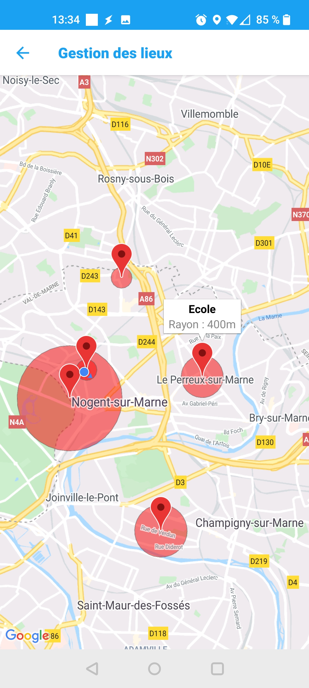
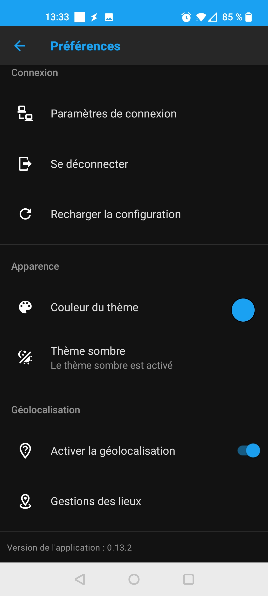
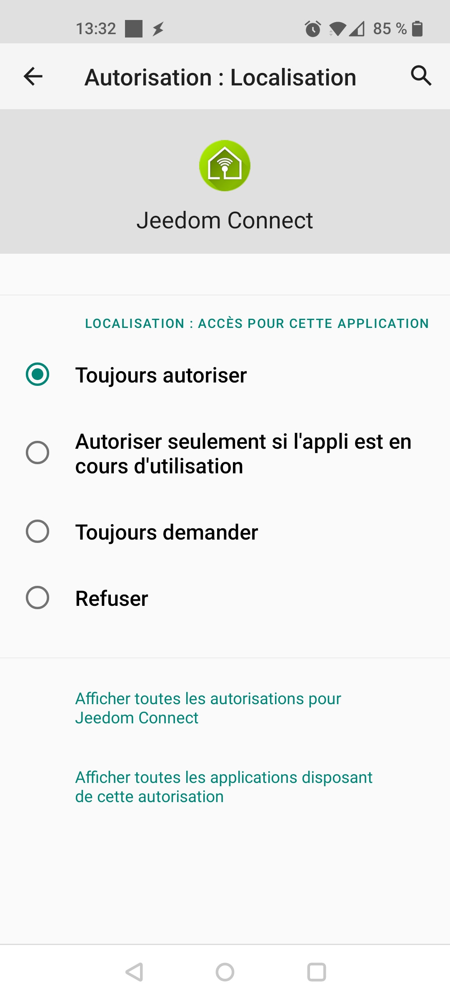
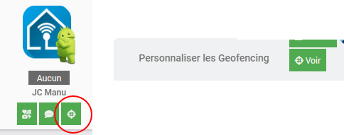
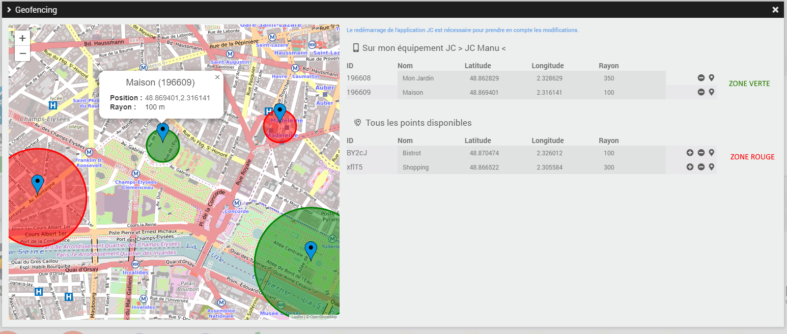
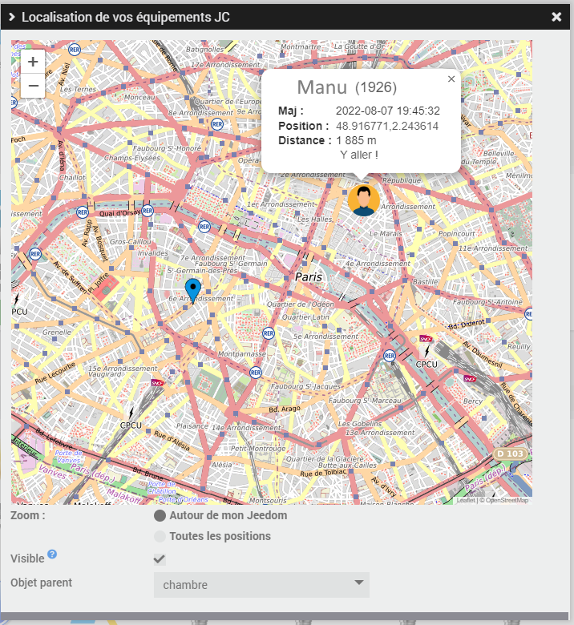

## Géolocalisation {#configGeofence}

Jeedom Connect dispose d'une fonction de Geofencing : définissez des lieux géographiques sur une carte et des commandes binaires seront créées dans votre équipement vous indiquant si l'appareil est dans ce lieu ou pas.

Commencez par ouvrir l'application et rendez-vous dans les Préférences puis activez la géolocalisation.  

Pour le bon fonctionnement du service, il est impératif d'accepter toutes les autorisations, en particulier la `Localisation` doit être sur `Toujours autoriser` (Android 10+)

Vous pouvez ensuite aller sur `Gestion des lieux`.

- Pour **définir une zone**, faites un appui long sur la carte puis donner un nom et un rayon (en mètres). Le binaire est immédiatement créé côté Jeedom.
- Pour **supprimer ou éditer une zone**, appuyez sur le marqueur puis sur le nom qui apparait.
- Pour **déplacer une zone**, faites un appui long sur le marqueur puis glisser.
Jeedom Connect possède aussi une fonction de Tracking qui vous permet de connaitre à tout moment la position de votre appareil. Les coordonnées GPS (latitude,longitude) sont accessibles dans la commande `Position` de votre équipement.  

 

Ces actions peuvent également être réalisées depuis le plugin, en utilisant la petite `cible` sous votre équipement, ou via le bouton `Personnaliser les Geofencing` sur la page de configuration de votre équipement JC :  

    

Vous arrivez sur une nouvelle fenêtre qui vous donne accès à 2 infos :  

- la 1ère partie concerne les zones utilisées pour faire du geofencing déjà disponible sur votre équipement. Ces zones sont représentées en vert sur la carte.  
- La 2nd partie, permet de voir toutes les zones qui ont été créées sur le plugin et qui peuvent être partagées entre différents équipements (ce qui évite d'avoir à recréer une zone "Maison" sur tous les appareils !). Ces zones sont représentées en rouge sur la carte.  

### Comment ajouter une zone ?

Cliquez sur la carte à l'endroit où vous désirez créer une zone puis sur le bouton `Créer une zone ici`. Celle-ci sera automatiquement ajoutée dans la partie `Tous les points disponibles`. Pour l'ajouter à votre équipement, il vous suffit de cliquer sur le petit `+` en bout de ligne, ce qui aura pour action de déplacer cette ligne sur votre équipement et de créer la commande correspondante dans votre équipement.

### Comment supprimer une zone de mon équipement ?

Cliquez sur l'icône `-` en bout de ligne, la zone est supprimée :

- de votre équipement, si c'est un point de la partie 'Mon équipement'
- de la configuration, si c'est un point de la partie 'Tous les points disponibles'. Dans ce dernier cas, cette zone ne sera plus proposée pour configurer un autre équipement.

### Comment centrer ma carte sur une zone ?

Cliquez simplement sur le dernier icone en forme de `pin`, la carte se centre automatiquement sur ce point

### Comment déplacer une zone ?

Les petits pin bleus utilisés pour caractériser la zone peuvent être déplacés. Cliquez sur le point à déplacer, allez au nouvel endroit désiré, relachez la souris, voilà le point est déplacé !  
Si vous connaissez les coordonnées GPS du nouveau point, vous pouvez également directement les saisir dans le tableau de droite, et la zone se mettra également à jour.

## Localisation depuis le plugin {#localisation}

Il est possible de suivre la localisation de vos équipements JC.  
Pour cela :

- l'option de tracking doit être activée sur votre application JC, de façon à ce que votre position soit remontée au plugin
- sur chaque équipement (sur le plugin), vous devez cocher la case `Afficher la position sur la carte globale` (et vous avez la possibilité de personnaliser le repère utilisé sur la carte pour identifier cet équipement)

Ensuite il suffit de cliquer sur le bouton `Localisation` disponible sur la page principale du plugin pour accèder à la carte.

Cette même carte peut être affichée sous forme de widget (au sens Jeedom du terme). Pour se faire, vous devez cocher la case `Visible` sur cette fenêtre, et sélectionner sous quel objet le widget devra être affiché.  

En cliquant sur les icônes présents vous aurez accès à plus de détails sur la position : le nom, la dernière mise à jour, les coordonnées, la distance entre ce point et votre jeedom (cf la page de configuration du plugin) et un lien pour rejoindre directement cette position.