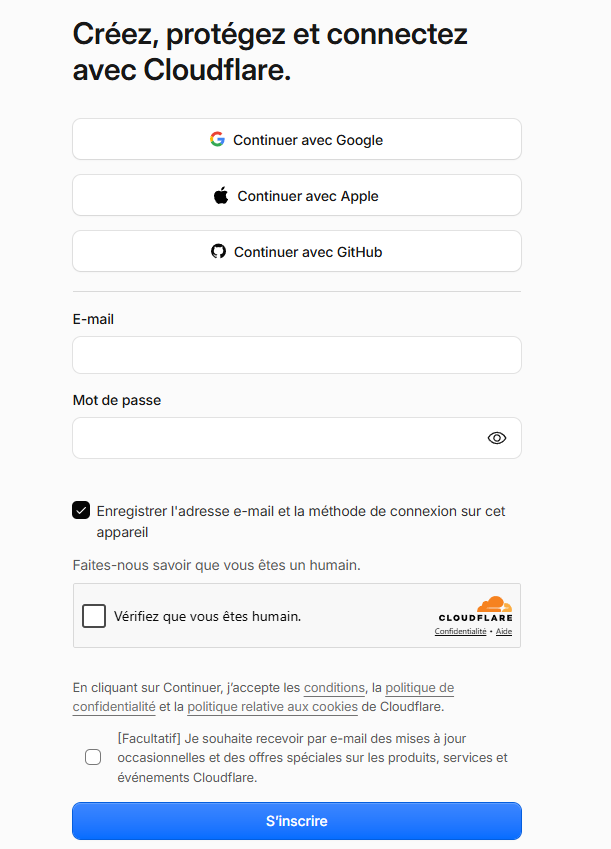
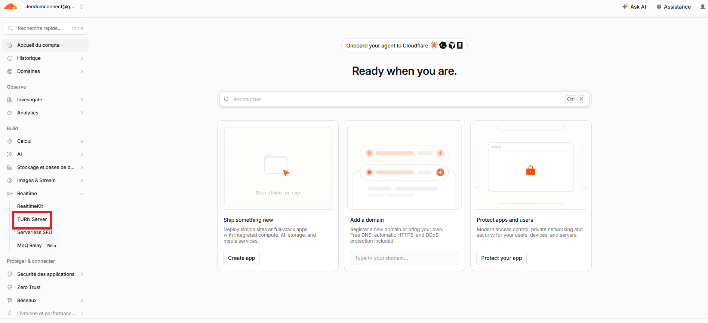
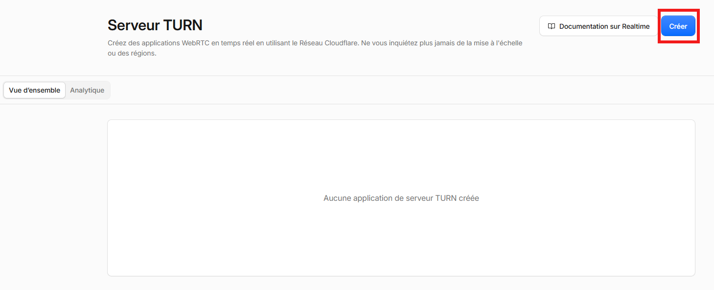
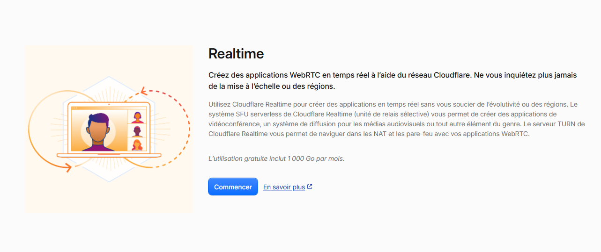
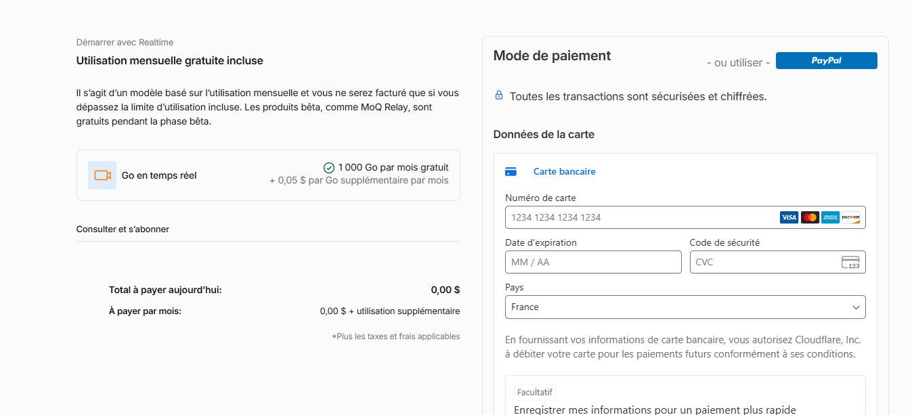
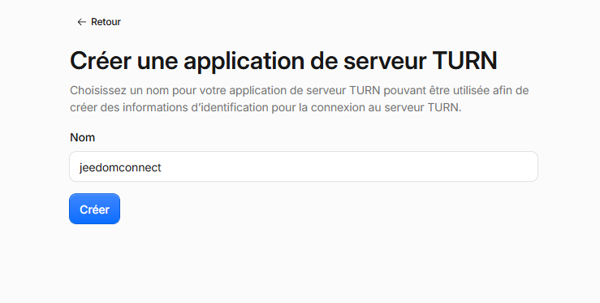
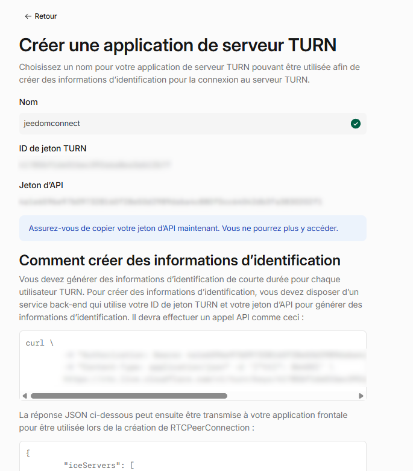
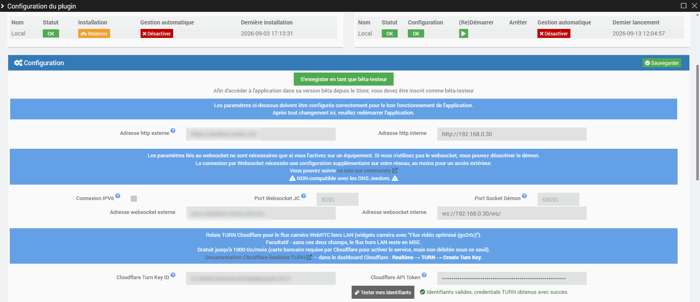

## À quoi sert cette configuration ?

Les widgets caméra utilisant l'option **"Flux vidéo optimisé (go2rtc)"** peuvent afficher le flux en **WebRTC** (faible latence, quasi instantané) même lorsque vous n'êtes pas sur le réseau local de votre Jeedom. Pour cela, il faut un **relais TURN** : un service qui permet à votre téléphone et à votre Jeedom de se joindre malgré les box/routeurs qui bloquent les connexions directes entrantes.

JeedomConnect utilise le service **Cloudflare Realtime TURN**, gratuit jusqu'à **1000 Go de données relayées par mois** (largement suffisant pour un usage personnel).

:::info
Cette configuration est **facultative**. Sans elle, les caméras hors LAN continuent de fonctionner normalement, simplement avec un flux vidéo un peu moins réactif (mode MSE).
:::

Ce tutoriel couvre l'option **gratuite** (votre propre compte Cloudflare). Si vous ne souhaitez pas créer de compte Cloudflare, un **abonnement géré** (avec essai gratuit sans carte bancaire) existe aussi - voir la page [Caméra hors LAN (relais TURN)](../documentation/integration/cameraTurn.md) pour comparer les deux options.

## Pré-requis

- Un compte Cloudflare (gratuit)
- Une carte bancaire à renseigner lors de l'activation du service (**demandée par Cloudflare, mais non débitée** tant que vous restez sous le palier gratuit de 1000 Go/mois)

:::warning
Si vous ne souhaitez donner aucune carte bancaire à Cloudflare, cette fonctionnalité n'est malheureusement pas utilisable pour l'instant - les caméras hors LAN resteront en mode MSE.
:::

## Étape 1 - Créer un compte Cloudflare

Rendez-vous sur [dash.cloudflare.com/sign-up](https://dash.cloudflare.com/sign-up) et inscrivez-vous (email/mot de passe, ou via Google/Apple/GitHub).

## Étape 2 - Accéder au serveur TURN

Une fois connecté au dashboard, dans le menu de gauche, dépliez **Realtime** puis cliquez sur **TURN Server**.

Vous arrivez sur la page **Serveur TURN**, vide pour l'instant. Cliquez sur **Créer**.

## Étape 3 - Activer Realtime

Si c'est la première fois que vous utilisez un produit Realtime, une page de présentation s'affiche, rappelant le palier gratuit de **1000 Go par mois**. Cliquez sur **Commencer**.

Cloudflare vous demande ensuite un moyen de paiement (carte bancaire ou PayPal) pour activer le service.

:::info
Ce moyen de paiement ne sera débité que si vous dépassez le palier gratuit de 1000 Go/mois.
:::

## Étape 4 - Créer votre application TURN

Donnez un nom à votre application TURN (par exemple `jeedomconnect`), puis cliquez sur **Créer**.

Cloudflare affiche alors les deux informations dont vous avez besoin : l'**ID de jeton TURN** et le **Jeton d'API**.

:::danger
Le **Jeton d'API** n'est affiché **qu'une seule fois**, à cet instant. Copiez-le immédiatement dans un endroit sûr - si vous le perdez, il faudra créer une nouvelle application TURN pour en obtenir un autre.
:::

## Étape 5 - Renseigner les identifiants dans JeedomConnect

Rendez-vous sur la page `Configuration` du plugin JeedomConnect, jusqu'à la section décrivant le relais TURN Cloudflare :

Renseignez :

- **Cloudflare Turn Key ID** : l'**ID de jeton TURN** récupéré à l'étape précédente
- **Cloudflare API Token** : le **Jeton d'API** récupéré à l'étape précédente

Cliquez sur **Sauvegarder**, puis sur le bouton **Tester mes identifiants** juste en dessous : un message vert confirme que tout est correctement configuré.

---

C'est terminé ! Vos widgets caméra en mode "Flux vidéo optimisé (go2rtc)" utiliseront désormais le relais Cloudflare automatiquement lorsque vous consultez une caméra hors de votre réseau local.
