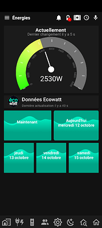
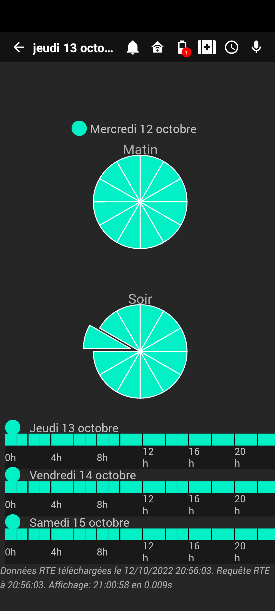
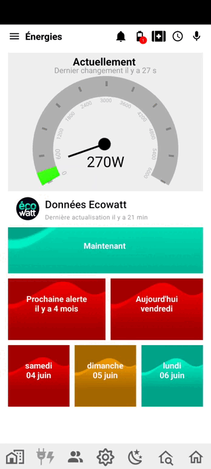

## Les données d'ecoWatt pour connaitre la prochaine journée Rouge

Besoin de voir d'un coup d'oeil les indicateurs ecoWatt (issus de RTE) temps réel, de la prochaine alerte, du jour et des jours J+1 à J+3, ainsi que le detail par plage horaire, accessible via un clic sur n’importe lequel des widgets

Voici un exemple de ce que vous pouvez faire :  

## Comment faire ?

Rendez-vous sur [cette page](https://community.jeedom.com/t/tuto-integration-des-infos-ecowatt-de-rte/92494)

:::info
Un grand merci à Norbert pour ce super tuto !
:::
