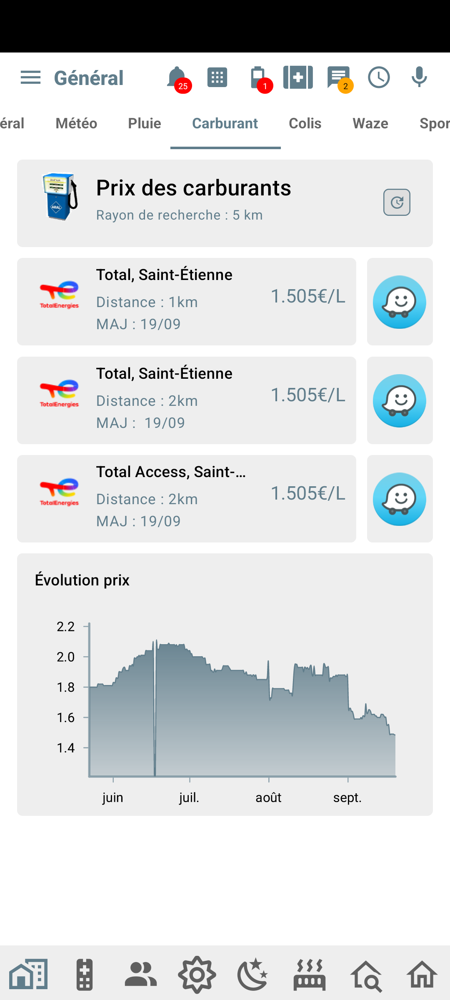

## Les stations services dans le coin

Le coup de la panne ne sera plus possible ...  
Quelle station service est la plus proche du lieux où vous vous trouvez ?  
Comment y aller ?  

Voici un exemple de ce que vous pouvez faire :  

## Comment faire ?

Rendez-vous sur [cette page](https://community.jeedom.com/t/tuto-integrer-le-prix-des-carburants-dans-jeedomconnect-geolocalisation-temps-reel-et-guidage-vers-les-stations/75336/65)

:::info
Un grand merci à Norbert pour ce super tuto !
:::
