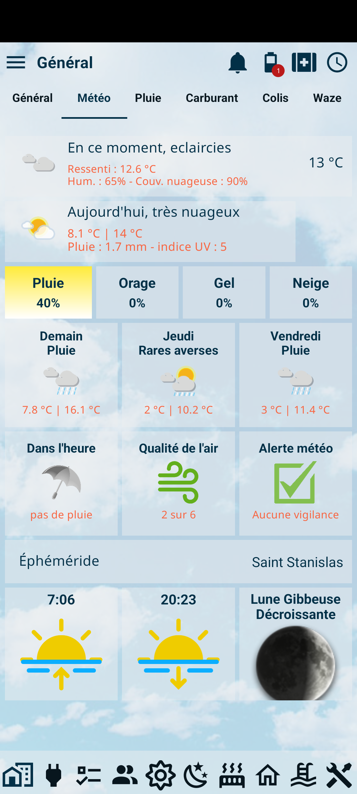

## La météo à porter de main

Vous souhaitez avoir une page avec différentes informations concernant la météo en cours et à venir ?  

Voici un exemple de ce que vous pouvez faire :  

Ceci n'est évidement qu'un exemple, vous avez entièrement la possibilité de ne pas créer/afficher certaine tuiles, d'en ajouter d'autres, de les disposer comme bon vous semble, ...  

## Comment faire ?

Rendez-vous sur [cette page](https://community.jeedom.com/t/tuto-creer-une-page-meteo-sur-jeedom-connect/77632)

:::info
Un grand merci à Norbert pour ce super tuto !
:::
