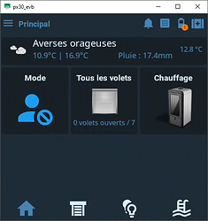
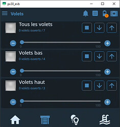
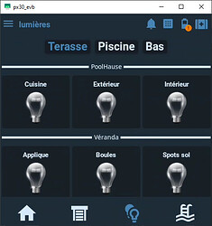
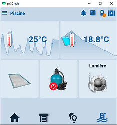

## JC directement disponible sur le mur

Outre l'application sur votre mobile, vous avez aussi la possibilité de mettre votre interface domotique préféré sur votre mur en utilisant un NSPanel

Voici un exemple de ce que vous pouvez faire :  

## Comment faire ?

Rendez-vous sur [cette page](https://community.jeedom.com/t/tutoriel-complet-nspanel-pro-et-jeedom/128851)

:::info
Un grand merci à Norbert pour ce super tuto !
:::
