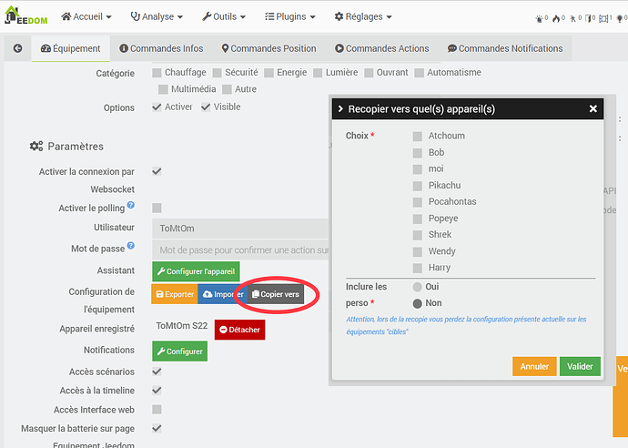

### J'aimerais avoir le même rendu avec la même disposition sur tous mes appareils, est ce possible ?

La réponse est oui, **mais**... ça dépend :) :)

### Recopier la configuration

Aujourd'hui vous avez la possibilité de dupliquer la configuration d'un équipement vers plusieurs autres équipement, grâce au bouton `Copier vers`  


Mais cette action ne fait que recopier les menus, la configuration des éléments (widgets/composants), ainsi qu'en option les personnalisations réalisées sur ceux-ci.  
La taille des éléments ainsi que leurs positions (*si vous êtes en grille avancée*) ne sont eux pas recopier d'un équipement à l'autre.

### Pourquoi pas les tailles & positions ?

Simplement parce que si la taille de l'écran de l'équipement cible est plus petite que celle de l'équipement source, alors les positions & les tailles ne peuvent pas s'appliquer !  
L'application essaiera de mettre les éléments avec la place disponible et se retrouvera coincée à certains moments.

Cette option n'est donc pas proposée sur le plugin, pour éviter d'avoir des dizaines de posts indiquant "ça ne fonctionne pas", alors que c'est tout à fait normal puisqu'il n'y a pas la place pour :slight_smile:  

### Les 3 téléphones de la maison sont strictement IDENTIQUES ➡️ donc même taille d'écran, comment faire dans ce cas ?

Dans le cas où l'ensemble de vos téléphones (source/cible) aurait la même taille d'écran, il est dans ce cas en effet dommage de devoir refaire toute la configuration à la main.

J'ai donc mis en place une opération manuelle qui va permettre de gagner un peu de temps et de récupérer la configuration des tailles et positions afin de l'appliquer à d'autres téléphones en quelques clics.

Cette méthode ne fonctionne que si :

- les téléphones ont [u]la même taille d'écran[/u] (normalement si vous avez tout lu jusqu'à là vous devez déjà l'avoir compris :sweat_smile:)
- uniquement si vous utilisez la fonction `Copier vers` [u]juste avant[/u] ! (un `copier vers` que vous avez fait il y a 5 mois ne sert plus à rien...)

#### Quelles sont les étapes ?

:::note
Disponible depuis les versions stable 1.8.0 et beta 1.7.5
:::

Sur l'application JC de l'équipement source (le "modèle")

1. Allez dans `menu > pref > Sauvergarder`, OK
Sur le plugin :
2. Ouvrez votre équipement JC source,
3. faites `Copier vers`, cochez les équipements JC cibles, la perso, puis OK
4. Allez dans les scénarios, créez en un nouveau, donnez lui un nom, activez le
5. Ajoutez un `bloc code`
6. Collez l'ensemble des éléments suivants :

```php
require_once dirname(__FILE__) . '/../../plugins/JeedomConnect/core/class/JeedomConnect.class.php';

$apiKeySource = 'azerty12345678';  // A MODIFIER
$apiKeyCible = 'f206772ff52e6e78d0e2b23,8993poiutr091' ;   // A MODIFIER - plusieurs clés peuvent être renseignées en les séparant par une virgule

JeedomConnectUtils::copyGridLayout($apiKeySource , $apiKeyCible );
```

7. Remplacez l'info `$apiKeySource` par la `Clé API` visible sur l'écran principale de l'équipement JC source
8. Remplacez l'info `$apiKeyCible` par la  `Clé API` visible sur l'écran principale de l'équipement JC cible (vous pouvez indiquer l api de plusieurs équipements cible en une tois, dans ce cas separez chaque clé par une virgule)
9. Sauvegardez le scénario
10. Exécutez le scénario  (check des logs si tout est OK)

Sur l'application JC de l'équipement cible :  
11. Allez dans `menu > pref > Restaurer`  
12. Choisissez la dernière sauvegarde nommée `GridLayout-xxxx`, puis OK  

➡️ les configuration de taille et position ont été appliquées à ce téléphone !

### Pourquoi ne pas mettre le script en automatique sur le plugin ?

Pour la même raison que précédemment :
éviter d'avoir des utilisateurs qui clic sur un bouton sans savoir exactement ce qu'il se passe derrière, et voir des dizaines de posts sur le forum "ça ne marche pas", simplement pcq les tailles d'écran sont différentes :slight_smile:

En rendant l'action manuelle, j'espère que l'utilisateur prendra le temps de lire l'ensemble du message présent pour savoir s'il peut ou pas appliquer cette méthode, et donc ne pas être étonné du résultat

:::info
Du coup ... puisque je sais que certains testeront quand même cette technique, alors que la cible est différente de la source, **aucun support** ne sera réalisé sur cette opération que vous suivrez et mettez en place par vous même.  😃
:::

Have fun !
