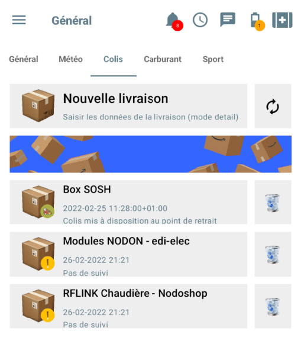

## Où est mon coli ?

Vous attendez des colis et souhaitez savoir où ils en sont ?  
Pouvoir en ajouter ?  

Voici un exemple de ce que vous pouvez faire :  

## Comment faire ?

Rendez-vous sur [cette page](https://community.jeedom.com/t/tuto-suivre-et-gerer-ses-livraisons-via-jeedomconnect/79950)

:::info
Un grand merci à Norbert pour ce super tuto !
:::
