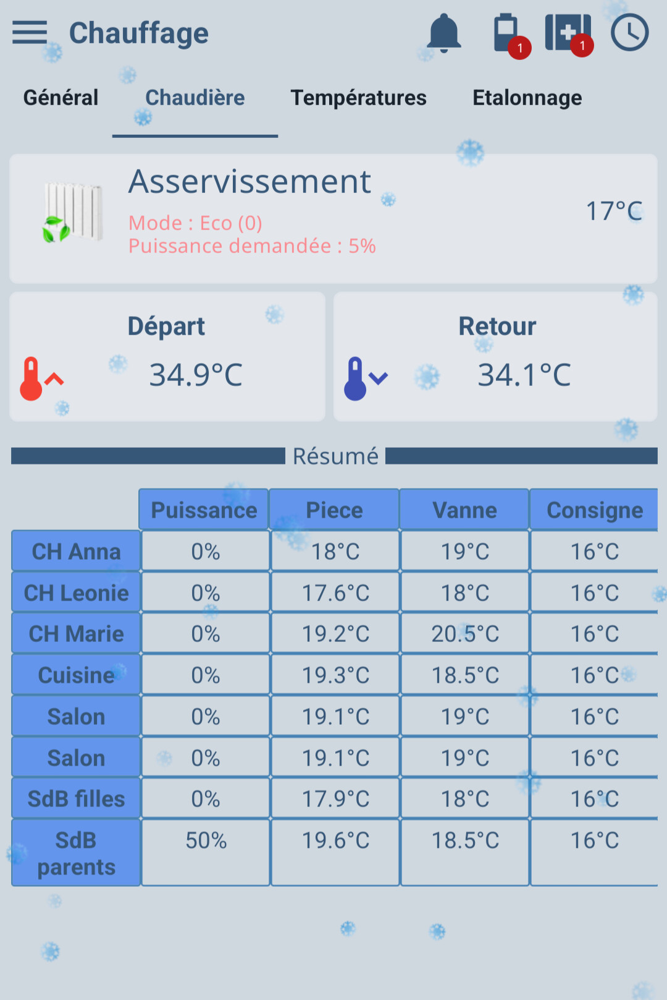

## Comment aligner toutes les infos dans un tableau

Vous aimez les choses carrées, bien alignées, résumé en un sens endroit ...  
Pourquoi ne pas tout mettre dans un tableau !?

Voici un exemple de ce que vous pouvez faire :  

## Comment faire ?

Rendez-vous sur [cette page](https://community.jeedom.com/t/tuto-afficher-un-tableau-html-dans-vos-pages/97831)

:::info
Un grand merci à Norbert pour ce super tuto !
:::
