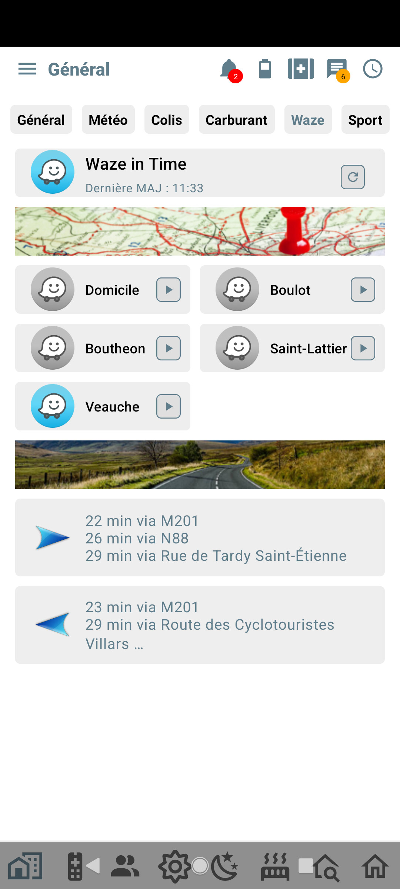

## Y'a du traffic ?

Combien de temps pour aller au bureau ?  
Quel meilleur itinéraire pour rentrer à la maison ?  

Toutes les informations sur votre mobile, et un baculement facilement sur Waze pour avoir l'itinéraire

Voici un exemple de ce que vous pouvez faire :  

## Comment faire ?

Rendez-vous sur [cette page](https://community.jeedom.com/t/tuto-integrer-de-maniere-dynamique-waze-in-time-a-jeedom-connect/85188)

:::info
Un grand merci à Norbert pour ce super tuto !
:::
